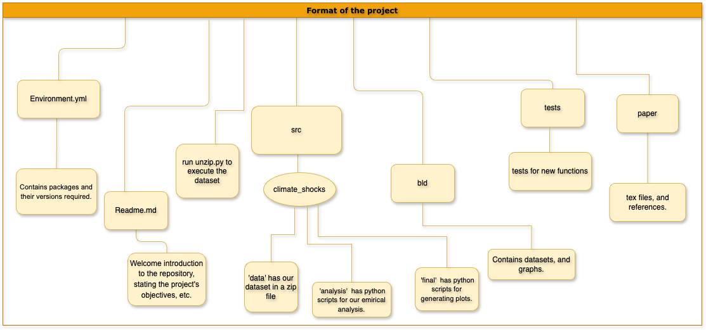

# Topic for Final Project
Climate Shocks - How do they influence individual behaviour, and how are they perceived?

## Table of contents

- [Description](#description)
- [Approach](#approach)
- [Requirements](#requirements)
- [Usage](#usage)
- [Credits](#credits)
- [Appendix](#appendix)

## Description of Project

For our Research Module paper (Applied Microeconomics) we worked on the topic "*Does an increased risk of climate shocks affect individual resource extraction behaviour?*, where we used two datasets - (i) Data from the a lab experiment conducted by our team at the University of Bonn's Laboratory, and (ii) an online survey. In this EPP project, we have **used the survey dataset** from the paper. 

An online survey was conducted among participants residing in Germany, Indonesia, and India. To be eligible to participate in the study, respondents had to reside in one of these countries, and be at least 18 years old. The data collection was carried out in January 2024, and the survey was scripted in the survey software Qualtrics. To take a look at the survey, check this [file](paper/Qualtrics_Survey.pdf).

The survey aims to assess individuals' awareness, attitudes, and behaviors towards tree cutting, environmental conservation, climate shocks, and pro-environmental actions, providing a comprehensive view of their environmental consciousness and engagement.

The main output of this project are the plots generated by the scripts, followed by a latex document that briefly describes the project, the data, and the results of the analyses.

## Approach

The overview of the project illustrated in the diagram below:

## Requirements

Before using this code, ensure that the following prerequisites are met:

* Python is installed.
* Conda or Mamba is installed and properly configured in your system.
* Python packages from `envrionment.yml` file are there, steps [mentioned](#usage).

## Usage

To utilize this code for the project, follow these steps:

#### Initial Setup:

To get started, create and activate the environment with

    $ conda/mamba env create -file environment.yml
    $ conda activate climate_shocks

Now you can build the project using

    $ pytask

For the final paper pdf to generate, please make sure that pytask-latex and all the latex related packages 
are properly installed.

Nevertheless, for reference, one downloaded copy has been kept [here](paper/climate_shocks.pdf).

Ensure all prerequisites are met as mentioned in the "Requirements" section.

### Run unzip.py:

Execute the following command to run the unzip.py script:

    python unzip.py

This script will unzip the file, and put our data to the bld folder.

### Testing 

Testing functions are located in tests folder. These functions are written to test and assert the original 
functions on a small representative data set.

Run the test file using

    $ pytest

## Credits

1. Our project is sourced from the template specified [here](https://econ-project-templates.readthedocs.io/en/latest/getting_started/index.html), after installing cookiecutter in our base terminal.

2. The template of our final paper is sourced from [here](https://zenodo.org/records/7780520) by Gaudecker, Hans-Martin von (2023), “Templates for Reproducible Research Projects in Economics”.

## Appendix

1. Tests for all new functions for generating plots [here](tests/analysis/test_plots.py).

2. Reasoning of test functions in [this markdown file](tests/answers.md).

3. To continue future research on this topic, an extra analysis has been [added](src/climate_shocks/final/age_distribution.py).

4. Doctstrings written in Google format.

5. One GitHub tag "EPP_final_project_SushmitaSaha" created to mark the finishing of the projected, after that all commits and changes are related to minor revisions.